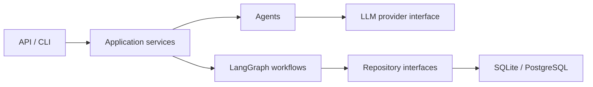

# StoryForge

StoryForge 计划成为一个面向长篇小说创作的多 Agent 系统，通过“规划、写作、事实抽取、一致性检查、评估、修订、记忆更新”的闭环逐章生成内容。

> 当前状态：Milestone 0（仓库初始化）已完成。现在只提供项目骨架和最小健康检查 API；领域模型、LLM、工作流与 CLI 尚未实现。

## 架构概览

项目采用模块化单体和 `src` 布局。HTTP、用例编排、领域数据、持久化、LLM、Agent 与工作流保持单向依赖，详细边界见 [架构文档](docs/architecture.md)。



这些组件是第一版目标架构，不代表当前里程碑已经实现全部功能。

## 工作流目标

```text
规划 → 写作 → 事实抽取 → 一致性检查 → 质量评估
    → 修订 → 再评估 → 接受或人工复核 → 更新长期记忆
```

工作流和 checkpoint 将在 Milestone 3–5 分步实现。

## 快速启动

需要 Python 3.12 和 [uv](https://docs.astral.sh/uv/)。

```powershell
uv sync
uv run uvicorn storyforge.api.app:app --reload
```

服务启动后可访问：

- 健康检查：`http://127.0.0.1:8000/health`
- OpenAPI 文档：`http://127.0.0.1:8000/docs`

示例响应：

```json
{"status":"ok","service":"storyforge","version":"0.1.0"}
```

## Mock 与真实模型

Milestone 0 不调用任何 LLM，也不需要 API Key。确定性的 Mock provider 和 OpenAI-compatible provider 将在 Milestone 2 实现；届时配置会写入 `.env.example`。

## API 与 CLI

当前只实现 `GET /health`。项目、章节和评估 API 将在 Milestone 6 暴露；`storyforge` CLI 与 `storyforge demo` 也将在该里程碑实现。

## 开发与测试

```powershell
uv run ruff format --check .
uv run ruff check .
uv run mypy src
uv run pytest
```

默认测试离线运行，不需要数据库服务、Docker 或 API Key。

## Docker

Dockerfile、Docker Compose 和可选 PostgreSQL 配置计划在 Milestone 7 添加。当前版本不假设本机安装 Docker。

## 当前限制

- 没有领域模型、数据库迁移或 repository 实现。
- 没有 LLM provider、Agent、检索、评估或 LangGraph 工作流。
- 没有业务 API、CLI 或 Docker 部署配置。
- 当前仅验证项目打包、工具链和最小 FastAPI 入口。

## Roadmap

完整阶段计划见 [ROADMAP.md](ROADMAP.md)。下一阶段是 Milestone 1：领域模型与数据库；需在明确指示后开始。

## License

[MIT](LICENSE)

