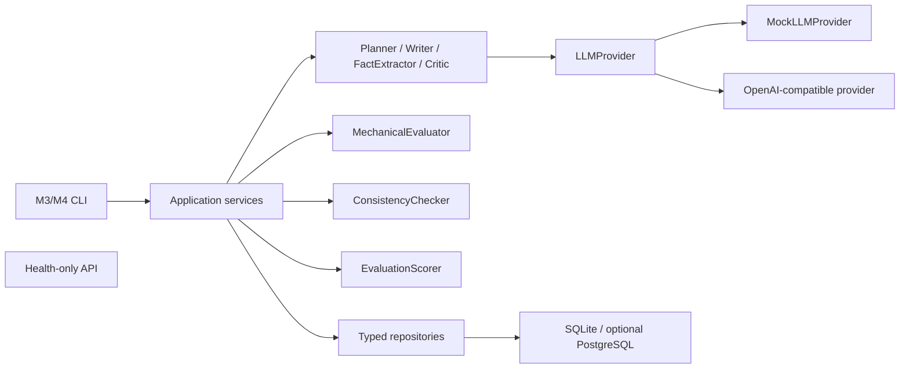

# StoryForge 架构

StoryForge 采用 Python 模块化单体和单向依赖，当前实现到 Milestone 4。



## 模块职责

- `api`：只负责 HTTP；M4 不增加业务 API，评估路由延后到 M6。
- `cli`：参数和输出适配，不实现评估规则。
- `services`：应用用例、状态转换、事务编排和失败恢复。
- `agents`：单一 LLM 职责，不访问数据库。`CriticAgent` 只做文学评审。
- `evaluation`：机械评估模型/配置、MechanicalEvaluator 和最终评分合并。
- `consistency`：事实归一化、规则配置、冲突模型和 ConsistencyChecker。
- `prompts`：所有 Agent Prompt 文本与版本的唯一目录。
- `llm`：所有模型调用的唯一出口。
- `repositories`：SQLAlchemy 查询与持久化隔离，不自行 commit。
- `models`：持久化模型；`schemas`：跨边界 Pydantic v2 结构。
- `workflows`：M5 才引入的 LangGraph 状态和路由，本阶段为空。

## M4 调用路径

```text
EvaluationService
  → load project/chapter and current-only evidence
  → chapter status = evaluating
  → MechanicalEvaluator (local)
  → ConsistencyChecker (local)
  → CriticAgent → LLMProvider → ChapterCritique validation
  → EvaluationScorer
  → one transaction:
      Evaluation + EvaluationIssue + Conflict + final chapter status/score
```

Critic 调用在数据库事务外执行。成功写入只有一个事务；重复评估新增版本，不更新旧 Evaluation。Critic 失败时另建 `partial_failed` Evaluation 保存本地结果，章节进入 `evaluation_failed`。

## 上下文边界

- Agent 不接收 ORM 对象，也不执行 SQL。
- Prompt 只接收显式 Pydantic 模型序列化的最小 JSON。
- Critic 只获得项目类型/前提、当前章计划/正文/摘要、相关人物公开状态、规则、上一章摘要、当前可见伏笔，以及机械/一致性摘要。
- Critic 不获得人物秘密、未来章摘要、未来来源事实或结局方向。
- ConsistencyChecker 读取当前章事实和更早章节有效事实；service 查询使用来源章节号和有效区间双重约束。
- 归一化只用于比较，原始事实和原文证据保持不变。

## 不变量

- MechanicalEvaluator 与 ConsistencyChecker 不调用 LLM、不访问网络、不写数据库。
- CriticAgent 输出必须通过 `ChapterCritique` 校验。
- 权重和必须为 1，公开分数均限制在 0–10。
- critical conflict 永远阻止通过；本阶段只给出建议，不触发修订。
- repository 只 flush；service 拥有 commit/rollback 边界。
- 普通日志不记录整章正文、Prompt、响应或敏感配置。

设计取舍见 [decisions/0003-m4-rule-evaluation-history.md](decisions/0003-m4-rule-evaluation-history.md)。
