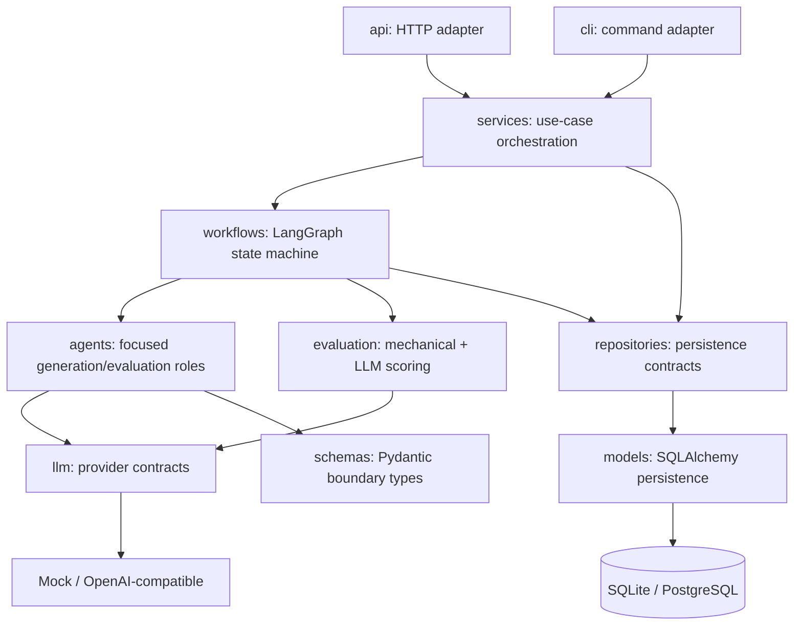
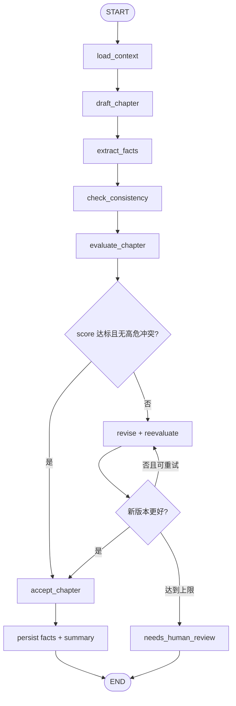

# StoryForge 架构

## 目标与当前范围

StoryForge 第一版采用模块化单体：在一个 Python 进程中保持明确边界，先获得可测试、可恢复的逐章生成闭环，再考虑拆分服务。Milestone 1 已实现关系模型、schema、repository、数据库配置和迁移；Agent、LLM、工作流与业务入口仍是后续里程碑的目标设计。

## 目标组件图

## 模块边界

| 模块 | 职责 | 不应承担 |
| --- | --- | --- |
| `api` | 路由、HTTP schema、状态码、异常映射 | 领域规则、数据库查询拼装 |
| `cli` | 命令解析与结果展示 | 复制 application service 逻辑 |
| `services` | 用例事务边界与高层编排 | provider 细节、HTTP 细节 |
| `workflows` | 状态类型、节点、路由、checkpoint/恢复 | 无边界的 prompt 或 ORM 对象传递 |
| `agents` | 单一 Agent 职责和结构化输入输出 | 持久化连接、全局流程控制 |
| `evaluation` | 机械检查、LLM 评审、加权汇总 | 章节持久化 |
| `repositories` | 持久化接口和 SQLAlchemy 实现 | HTTP/CLI 表示逻辑 |
| `models` | SQLAlchemy 表映射 | API 响应或 prompt 结构 |
| `schemas` | Pydantic v2 边界、状态与 LLM 输出模型 | 数据库会话和副作用 |
| `llm` | 统一 provider 接口、重试、超时、脱敏 | Agent 业务策略 |

## 依赖方向

- 入口适配器（API/CLI）依赖 services，而不是直接依赖数据库实现。
- workflows 通过 Agent、evaluation 和 repository 抽象协作。
- agents 依赖最小 schema 与 LLM 抽象，不接收 SQLAlchemy 对象。
- LLM、数据库和未来外部服务都要有可替换接口；测试默认使用本地实现。
- Pydantic schema 是跨模块和 LLM 边界的数据契约；SQLAlchemy model 只留在持久化边界。

## 计划中的章节工作流

工作流状态只保存显式、可序列化的 ID 和 schema。每个节点更新 `WorkflowRun`，checkpoint 与业务数据提交边界将在 Milestone 5 明确。

## 目录策略

- `src/storyforge/api` 当前只包含健康检查；`models`、`schemas`、`repositories` 和 `database.py` 已包含 Milestone 1 的可运行数据层。
- `agents`、`llm`、`evaluation`、`services`、`workflows` 和 `cli` 仍以 `.gitkeep` 记录后续边界，等对应里程碑出现真实行为时再增加模块。
- `tests/unit` 和 `tests/integration` 分别保存隔离逻辑测试与跨边界测试。
- `alembic` 在 Milestone 1 初始化，`scripts` 仅接收可重复的开发辅助脚本。

## 里程碑映射

- M0：包结构、质量门禁、健康检查。
- M1：models、schemas、repositories 和 Alembic（已完成）。
- M2：llm provider 抽象与实现。
- M3：Planner/Writer/FactExtractor、ContextBuilder、首条生成路径。
- M4：一致性和两层评估。
- M5：完整 LangGraph 修订闭环、checkpoint 与恢复。
- M6：业务 API 与 CLI。
- M7：Docker、PostgreSQL 运行配置和完整运维文档。
