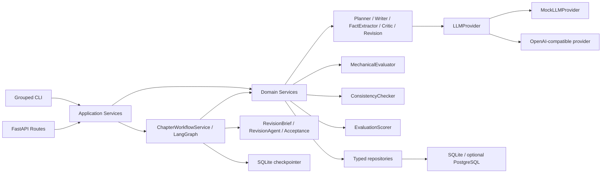

# StoryForge 架构

StoryForge 采用 Python 模块化单体和单向依赖，当前实现到 Milestone 7。



## 模块职责

- `api`：应用工厂、lifespan、依赖注入、HTTP 路由、中间件和异常映射；不含领域规则或 SQL。
- `application`：供 API/CLI 共用的用例边界，返回 Pydantic DTO，并协调已有 domain service/repository。
- `cli`：参数、human/JSON 输出和退出码适配，不实现评估或工作流规则，也不经 HTTP 绕行。
- `services`：应用用例、状态转换、事务编排和失败恢复。LangGraph 节点只调用这些服务，不复制 M3/M4 逻辑。
- `agents`：单一 LLM 职责，不访问数据库。`CriticAgent` 只做文学评审。
- `evaluation`：机械评估模型/配置、MechanicalEvaluator 和最终评分合并。
- `consistency`：事实归一化、规则配置、冲突模型和 ConsistencyChecker。
- `revision`：RevisionBriefBuilder、成对版本模型和规则优先 AcceptanceEvaluator。
- `prompts`：所有 Agent Prompt 文本与版本的唯一目录。
- `llm`：所有模型调用的唯一出口。
- `repositories`：SQLAlchemy 查询与持久化隔离，不自行 commit。
- `models`：持久化模型；`schemas`：跨边界 Pydantic v2 结构。
- `workflows`：可序列化状态、公开请求/状态模型和集中状态转换；不保存 ORM/session/provider。

## M6 接口边界与依赖注入

`create_app(settings)` 只构建 ASGI 应用。数据库 engine/session factory 在 lifespan 启动时创建并在关闭时 dispose；模块导入不连接数据库，也不自动执行 migration。测试显式传入 `Settings(environment="test", ...)`。

```text
FastAPI route / grouped CLI
  → Project|Planning|Chapter|Evaluation|Workflow ApplicationService
  → existing Domain Service or typed Repository
  → SQLAlchemy / LLMProvider
```

Provider、PromptRegistry、ContextBuilder、EvaluationService 和 ChapterWorkflowService 由 `DomainServiceFactory` 按操作构造。Mock 与 OpenAI-compatible 共用相同接口；生产配置缺失时失败，不会静默回退 Mock。工作流 HTTP 入口保持当前同步语义并返回 201，不伪装 202 后台任务。

请求 ID 中间件只记录 method、path、status、duration 和 request ID。异常处理器将领域/配置/provider/数据库错误映射为稳定响应，永不返回 traceback、原始 SQL 错误、连接 URL、正文、Prompt 或密钥。

列表查询由 repository 执行 COUNT/LIMIT/OFFSET，排序字段使用白名单。Chapter/Version 默认省略正文；Fact 公共查询强制 accepted 状态，并在 `valid_at_chapter` 查询中同时限制来源章节和有效区间。

## M4 调用路径

```text
EvaluationService
  → load project/chapter and current-only evidence
  → chapter status = evaluating
  → MechanicalEvaluator (local)
  → ConsistencyChecker (local)
  → CriticAgent → LLMProvider → ChapterCritique validation
  → EvaluationScorer
  → one transaction:
      Evaluation + EvaluationIssue + Conflict + final chapter status/score
```

Critic 调用在数据库事务外执行。成功写入只有一个事务；重复评估新增版本，不更新旧 Evaluation。Critic 失败时另建 `partial_failed` Evaluation 保存本地结果，章节进入 `evaluation_failed`。

## M5 工作流边界

```text
ChapterWorkflowService / StateGraph
  → ContextBuilder
  → ChapterVersionService → WriterAgent / FactExtractorAgent
  → EvaluationService → Mechanical / Consistency / Critic / Scorer
  → RevisionBriefBuilder → RevisionAgent
  → AcceptanceEvaluator
  → ChapterVersionService.accept/reject/needs_review
```

节点负责状态传递、条件路由、checkpoint 和循环次数。节点不执行 SQL、不创建全局 session、不读取环境变量，也不拼接大型 Prompt。持久化副作用由注入的 service/repository 完成。

checkpoint 与领域数据库分离：LangGraph SQLite 文件使用 `thread_id` 关联 WorkflowRun，只保存 ID、小型字典、路由和时间戳。正文保存在 ChapterVersion，checkpoint 只保存 version ID。数据库唯一键覆盖版本生成、Evaluation 和 Fact，确保节点恢复重放不会重复副作用。

## 上下文边界

- Agent 不接收 ORM 对象，也不执行 SQL。
- Prompt 只接收显式 Pydantic 模型序列化的最小 JSON。
- Critic 只获得项目类型/前提、当前章计划/正文/摘要、相关人物公开状态、规则、上一章摘要、当前可见伏笔，以及机械/一致性摘要。
- Critic 不获得人物秘密、未来章摘要、未来来源事实或结局方向。
- ConsistencyChecker 读取当前版本 candidate Fact 和更早章节 accepted Fact；service 查询使用状态、来源章节号和有效区间约束。
- RevisionAgent 只接收当前来源版本、RevisionBrief、当前章 outline、已接受事实和 ContextBuilder 提供的当前可见上下文。
- 归一化只用于比较，原始事实和原文证据保持不变。

## 不变量

- MechanicalEvaluator 与 ConsistencyChecker 不调用 LLM、不访问网络、不写数据库。
- CriticAgent 输出必须通过 `ChapterCritique` 校验。
- 权重和必须为 1，公开分数均限制在 0–10。
- critical conflict 永远阻止接受；EvaluationService 给出建议，M5 路由结合所有阻断条件决定接受、修订或人工复核。
- repository 只 flush；service 拥有 commit/rollback 边界。
- 普通日志不记录整章正文、Prompt、响应或敏感配置。
- 未接受版本事实永远不进入 ContextBuilder；接受版本与事实提升在同一事务。
- 新版本更差时不会覆盖 WorkflowRun.best_version_id。

## M7 运行与部署边界

```text
postgres healthcheck
  → migrate one-shot service: wait for connection → alembic upgrade head
  → api: Uvicorn factory → /health + exact-head /api/v1/ready
```

Docker 镜像使用锁定依赖、多阶段构建和 UID/GID 10001 非 root 用户。应用进程不在 import time 连接数据库，也不默认迁移；Compose 让 migration 成为 API 的成功前置条件。SQLite 继续负责零依赖本地开发与 checkpoint，PostgreSQL 16 是 Compose 和跨数据库集成测试的关系数据库。

Settings 对 development/test/production 分别校验。生产必须显式 PostgreSQL、非 Mock provider 和非开发密码；文本/JSON 日志写 stdout，HTTP 日志只记录 request ID、方法、路径、状态和耗时。当前部署没有认证、队列或多副本 checkpoint，不应直接暴露公网。

设计取舍见 [decisions/0003-m4-rule-evaluation-history.md](decisions/0003-m4-rule-evaluation-history.md)、[decisions/0004-m5-durable-revision-workflow.md](decisions/0004-m5-durable-revision-workflow.md)、[decisions/0005-m6-application-interfaces.md](decisions/0005-m6-application-interfaces.md) 和 [decisions/0006-m7-container-postgres-delivery.md](decisions/0006-m7-container-postgres-delivery.md)。

## M8 长期记忆与混合检索

`embeddings` 是 embedding 调用的唯一出口；`memory` 负责切分、索引生命周期和状态隔离；`graph` 负责受控实体/关系抽取与最多 2 hops 查询；`retrieval` 负责四路召回、融合、去重和重排。API/CLI 只调用 `MemoryApplicationService`，不直接查询 ORM。

```text
accepted ChapterVersion
  → MemoryIndexService
  → structural chunks → EmbeddingProvider → PostgreSQL vector(64)
  → rule-first graph extraction → graph entity/relation tables

chapter outline → RetrievalQueryBuilder
  → keyword + pgvector + accepted facts + graph
  → weighted RRF → dedup → deterministic rerank → context budget
```

接受事务只创建 pending 索引并原子隐藏旧版本 memory；embedding 在事务外执行。provider 失败不会撤销已接受正文，而是把索引标为 failed，检索明确降级。ContextBuilder 始终保留项目、当前大纲和 active rules，memory 最后进入预算。详见 [memory.md](memory.md)、[retrieval.md](retrieval.md)、[graph.md](graph.md) 和 [ADR 0007](decisions/0007-m8-pgvector-hybrid-memory.md)。
