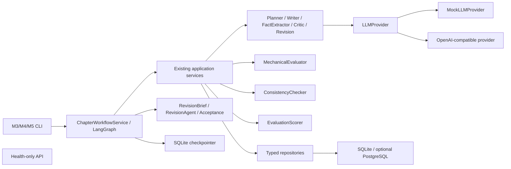

# StoryForge 架构

StoryForge 采用 Python 模块化单体和单向依赖，当前实现到 Milestone 5。



## 模块职责

- `api`：只负责 HTTP；业务路由延后到 M6，当前仍只有 health。
- `cli`：参数和输出适配，不实现评估或工作流规则。
- `services`：应用用例、状态转换、事务编排和失败恢复。LangGraph 节点只调用这些服务，不复制 M3/M4 逻辑。
- `agents`：单一 LLM 职责，不访问数据库。`CriticAgent` 只做文学评审。
- `evaluation`：机械评估模型/配置、MechanicalEvaluator 和最终评分合并。
- `consistency`：事实归一化、规则配置、冲突模型和 ConsistencyChecker。
- `revision`：RevisionBriefBuilder、成对版本模型和规则优先 AcceptanceEvaluator。
- `prompts`：所有 Agent Prompt 文本与版本的唯一目录。
- `llm`：所有模型调用的唯一出口。
- `repositories`：SQLAlchemy 查询与持久化隔离，不自行 commit。
- `models`：持久化模型；`schemas`：跨边界 Pydantic v2 结构。
- `workflows`：可序列化状态、公开请求/状态模型和集中状态转换；不保存 ORM/session/provider。

## M4 调用路径

```text
EvaluationService
  → load project/chapter and current-only evidence
  → chapter status = evaluating
  → MechanicalEvaluator (local)
  → ConsistencyChecker (local)
  → CriticAgent → LLMProvider → ChapterCritique validation
  → EvaluationScorer
  → one transaction:
      Evaluation + EvaluationIssue + Conflict + final chapter status/score
```

Critic 调用在数据库事务外执行。成功写入只有一个事务；重复评估新增版本，不更新旧 Evaluation。Critic 失败时另建 `partial_failed` Evaluation 保存本地结果，章节进入 `evaluation_failed`。

## M5 工作流边界

```text
ChapterWorkflowService / StateGraph
  → ContextBuilder
  → ChapterVersionService → WriterAgent / FactExtractorAgent
  → EvaluationService → Mechanical / Consistency / Critic / Scorer
  → RevisionBriefBuilder → RevisionAgent
  → AcceptanceEvaluator
  → ChapterVersionService.accept/reject/needs_review
```

节点负责状态传递、条件路由、checkpoint 和循环次数。节点不执行 SQL、不创建全局 session、不读取环境变量，也不拼接大型 Prompt。持久化副作用由注入的 service/repository 完成。

checkpoint 与领域数据库分离：LangGraph SQLite 文件使用 `thread_id` 关联 WorkflowRun，只保存 ID、小型字典、路由和时间戳。正文保存在 ChapterVersion，checkpoint 只保存 version ID。数据库唯一键覆盖版本生成、Evaluation 和 Fact，确保节点恢复重放不会重复副作用。

## 上下文边界

- Agent 不接收 ORM 对象，也不执行 SQL。
- Prompt 只接收显式 Pydantic 模型序列化的最小 JSON。
- Critic 只获得项目类型/前提、当前章计划/正文/摘要、相关人物公开状态、规则、上一章摘要、当前可见伏笔，以及机械/一致性摘要。
- Critic 不获得人物秘密、未来章摘要、未来来源事实或结局方向。
- ConsistencyChecker 读取当前版本 candidate Fact 和更早章节 accepted Fact；service 查询使用状态、来源章节号和有效区间约束。
- RevisionAgent 只接收当前来源版本、RevisionBrief、当前章 outline、已接受事实和 ContextBuilder 提供的当前可见上下文。
- 归一化只用于比较，原始事实和原文证据保持不变。

## 不变量

- MechanicalEvaluator 与 ConsistencyChecker 不调用 LLM、不访问网络、不写数据库。
- CriticAgent 输出必须通过 `ChapterCritique` 校验。
- 权重和必须为 1，公开分数均限制在 0–10。
- critical conflict 永远阻止接受；EvaluationService 给出建议，M5 路由结合所有阻断条件决定接受、修订或人工复核。
- repository 只 flush；service 拥有 commit/rollback 边界。
- 普通日志不记录整章正文、Prompt、响应或敏感配置。
- 未接受版本事实永远不进入 ContextBuilder；接受版本与事实提升在同一事务。
- 新版本更差时不会覆盖 WorkflowRun.best_version_id。

设计取舍见 [decisions/0003-m4-rule-evaluation-history.md](decisions/0003-m4-rule-evaluation-history.md) 和 [decisions/0004-m5-durable-revision-workflow.md](decisions/0004-m5-durable-revision-workflow.md)。
