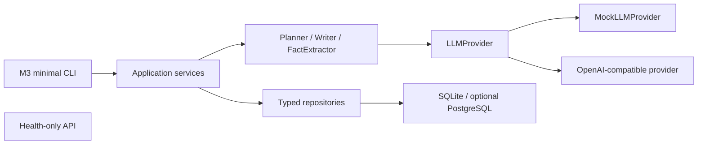

# StoryForge 架构

StoryForge 采用 Python 模块化单体和单向依赖。当前实现到 Milestone 3；图中的评估、LangGraph 和完整 API 不属于当前代码。



## 模块职责

- `api`：只负责 HTTP。M3 不增加业务 API。
- `cli`：M3 的最小可执行入口，只做参数与输出转换；业务逻辑调用 service。
- `services`：应用用例、状态迁移与事务编排。
- `agents`：单一 LLM 职责，不直接访问数据库。
- `prompts`：M3 Prompt 文本与版本的唯一目录，复用 M2 `PromptRegistry`。
- `llm`：所有模型调用的唯一出口。
- `repositories`：SQLAlchemy 查询与持久化隔离，不自行 commit。
- `models`：持久化模型；`schemas`：跨边界的 Pydantic v2 结构。
- `workflows`、`evaluation`：仍未实现，保留给后续里程碑。

## M3 调用路径

规划：

```text
PlanningService → PlannerAgent → LLMProvider → NovelPlan validation
               → one transaction: project metadata + characters + locations
                 + rules + chapter plans + foreshadowing
```

章节生成：

```text
ChapterGenerationService → ContextBuilder → WriterAgent
                         → persist draft + full ChapterVersion snapshot
                         → FactExtractorAgent
                         → one transaction: facts + state updates + final status
```

## 边界不变量

- Agent 不接收 ORM 对象，也不执行 SQL。
- Prompt 只接收显式 Pydantic 模型序列化后的最小 JSON。
- LLM 输出先通过 Pydantic 校验，再进入 service。
- ContextBuilder 只读取当前章与更早章节产生的知识，不传角色秘密或结局方向。
- repository 只 flush；service 拥有 commit/rollback 边界。
- 章节正文先持久化，再提取事实；事实失败不会丢失已生成正文。

设计取舍见 [decisions/0002-m3-planning-context-transactions.md](decisions/0002-m3-planning-context-transactions.md)。
