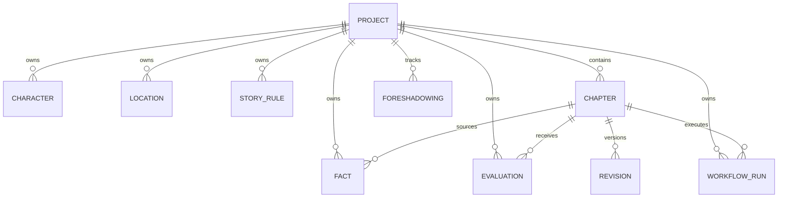

# StoryForge 数据模型

## 范围

Milestone 1 使用 SQLAlchemy 2 定义关系模型，SQLite 是默认开发/测试数据库，PostgreSQL + Psycopg 3 是可选运行配置。Pydantic v2 schema 是跨边界数据契约，ORM 实例不应直接传入未来的 prompt 或 HTTP 响应。

## 关系概览



所有外键删除动作使用 `ON DELETE CASCADE`，SQLite engine 自动执行 `PRAGMA foreign_keys=ON`。ORM relationship 同时配置 `all, delete-orphan` 与 `passive_deletes`，既支持对象图操作，也允许数据库在未加载集合时完成级联。

## 表定义

### projects

| 字段 | 类型 | 约束 |
| --- | --- | --- |
| id | integer | 主键 |
| title | varchar(200) | 非空 |
| genre | varchar(100) | 非空 |
| premise | text | 非空 |
| target_chapters | integer | 大于 0 |
| target_words_per_chapter | integer | 大于 0 |
| status | enum string | `draft/planning/active/completed/archived` |
| created_at / updated_at | timezone datetime | 非空、自动赋值 |

### characters

包含 `project_id`、name、role、description、JSON goals、personality、speech_style、current_state 和 JSON secrets。`(project_id, name)` 唯一。

### locations

包含 `project_id`、name、description 和 JSON rules。`(project_id, name)` 唯一。

### story_rules

包含 `project_id`、category、statement、source 和 active；active 默认为 true。

### chapters

包含 `project_id`、chapter_number、title、outline、content、summary、status、version、score、created_at 和 updated_at。

- `(project_id, chapter_number)` 唯一。
- chapter_number 和 version 必须大于 0。
- score 可空；存在时必须在 0..100。
- status 可取 `planned/draft/evaluating/needs_revision/accepted/needs_human_review`。

### facts

包含 `project_id`、chapter_id、subject、predicate、object、valid_from_chapter、valid_to_chapter、confidence 和 source_quote。

- valid_from_chapter 必须大于 0。
- valid_to_chapter 可空；存在时不得小于 valid_from_chapter。
- confidence 必须在 0..1。

### foreshadowings

包含 `project_id`、setup_chapter、expected_payoff_chapter、description、status 和可空 payoff_chapter。预期和实际回收章节不得早于铺垫章节。

### evaluations

包含 `project_id`、chapter_id、evaluator、overall/consistency/prose/character/plot 五项分数、JSON issues、JSON suggestions 和 created_at。每项分数均限制在 0..100。

### revisions

包含 `chapter_id`、previous_version、new_version、reason、score_before、score_after、accepted 和 created_at。

- previous_version 必须大于 0。
- new_version 必须大于 previous_version。
- `(chapter_id, new_version)` 唯一。
- 修改前后分数均限制在 0..100。

### workflow_runs

包含 `project_id`、chapter_id、current_node、status、retry_count、error_message、started_at 和 finished_at。

- 每个 run 必须关联 project 和 chapter。
- retry_count 不得为负。
- finished_at 可空；存在时不得早于 started_at。
- status 可取 `pending/running/succeeded/failed/needs_human_review`。

## Pydantic schema

每个实体均提供 `Create`、`Update` 和 `Read` 模型。请求模型拒绝额外字段并执行字符串/数值/跨字段校验；响应模型使用 `ConfigDict(from_attributes=True)` 从 ORM 属性构建，不嵌套 relationship，从而避免意外 lazy load 或循环序列化。

## Repository 与事务

`Repository[T]` 提供 add/get/list/update/delete。add/update/delete 只执行 `flush`，不执行 commit；application service 或调用方使用 `transactional_session()` 统一提交，异常时由 `sessionmaker.begin()` 自动回滚。

repository 的 update 只接受非主键标量列，拒绝未知字段、主键和 relationship 修改。

## 迁移

首迁移位于 `alembic/versions/`，Alembic 从 `Base.metadata` 读取表结构，并动态使用 `DATABASE_URL`。

```powershell
uv run alembic upgrade head
uv run alembic check
uv run alembic downgrade base
```

